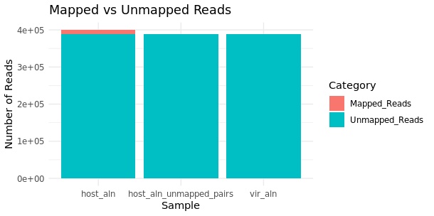

# MDR-TB Genomics Pipeline

### Phase 1 – Quality Control (QC)

This repository documents the step-by-step replication of the pipeline from:

**Comparative genomic analysis of multi-drug resistant *Mycobacterium tuberculosis* clinical isolates from Nigeria (PLOS ONE, 2021)**  
 [Link to article](https://journals.plos.org/plosone/article?id=10.1371/journal.pone.0258774)

---

##  Environment Setup

```bash
# 1. Check conda installation
conda --version
```
# 2. Configure channels
```bash
conda config --add channels defaults
conda config --add channels bioconda
conda config --add channels conda-forge
conda config --set channel_priority strict
```
# 3. Create project environment
```bash
conda create -n tbqc fastqc multiqc trimmomatic bwa samtools bcftools -y
```
# 4. Activate environment
```bash
conda activate tbqc
```
# 5. Verify tool versions
```bash
fastqc -h
multiqc -h
trimmomatic -h
bwa
samtools
bcftools
```
# 6. Tools Versions
   ```bash
    FastQC v0.12.1
    multiqc, version 1.30
    Trimmomatic v0.39
    conda 25.5.1
   ```

# 7. Quality Control Workflow 
The raw Illumina paired-end reads were subjected to quality control using FastQC and summarized with MultiQC. Adapter trimming and low-quality base removal were performed with Trimmomatic. The pipeline ensured that downstream analysis used only high-quality reads.


After activating the environment:

# 1. Run FastQC on raw reads
```bash
fastqc raw_data/*.fastq.gz -o qc/pre_trim/
```
# 2. Summarize results with MultiQC
```bash
multiqc qc/pre_trim/ -o qc/pre_trim/
```
# 3. Trim adapters and low-quality reads
```bash
trimmomatic PE -threads 4 -phred33 \
  raw_data/sample_R1.fastq.gz raw_data/sample_R2.fastq.gz \
  qc/sample_R1_paired.fq.gz qc/sample_R1_unpaired.fq.gz \
  qc/sample_R2_paired.fq.gz qc/sample_R2_unpaired.fq.gz \
  ILLUMINACLIP:/path/to/Trimmomatic/adapters/TruSeq3-PE.fa:2:30:10 \
  LEADING:3 TRAILING:3 SLIDINGWINDOW:4:15 MINLEN:36
```
# 4. Run FastQC again on trimmed reads
```bash
fastqc qc/*_paired.fq.gz -o qc/post_trim/
```
# 5. Summarize post-trim QC with MultiQC
```bash
multiqc qc/post_trim/ -o qc/post_trim/
```


# QC Summary (Biological Interpretation)

Based on the quality control analyses of the Mycobacterium tuberculosis SRR31065062 sequencing data:

#Per-base quality (Phred scores)
*Post-trimming reads exhibit median Phred scores ≥ 30, indicating very low base-calling errors (<0.1%).
*This ensures high confidence in nucleotide calls, which is essential for alignment, variant detection, and downstream classification.

#Adapter sequences
*Raw reads contained Illumina adapter contamination, particularly at the 3′ ends.
*Trimming successfully removed these adapters, preventing false alignments and improving the accuracy of downstream analyses.

#Read length distribution
*Trimming removed low-quality bases from read ends, resulting in slightly shorter reads.
*The retained read lengths remain sufficient for genome coverage and robust taxonomic profiling.

#GC content
*Raw reads had a slightly lower GC content (~61%) due to low-quality AT-rich tails.
*Post-trimming reads show GC content ~64%, closer to the expected M. tuberculosis genome (~65%).
*This confirms that trimming enriches for true biological sequences and reduces sequencing artifacts.

#Overall data integrity
*No excessive duplication or abnormal sequence patterns detected after trimming.
*The dataset maintains biological fidelity, reflecting the characteristics of M. tuberculosis without evidence of major contamination.

##All QC and trimming commands are saved in `scripts/qc_commands.sh` for reproducibility.


# PHASE2-ALIGHMENT, FILTERING AND TAXONOMIC CLASSIFICATION

# MDR-TB Genomics Pipeline (Phase 2 - Alignment, filtering and taxonomic classification)
This phase focuses on removing human and viral reads from metagenomic data and classifying bacterial sequences using Centrifuge for taxonomic profiling. All visualizations were performed using RStudio Server.

#This repository documents the step-by-step replication of Phase 2 from:

#Comparative genomic analysis of multi-drug resistant Mycobacterium tuberculosis clinical isolates from Nigeria (PLOS ONE, 2021)


# 1. Environment Setup
Phase 2 builds upon the tbqc Conda environment created in Phase 1, with additional R and visualization dependencies.

# Activate environment
```bash
conda activate tbqc
```
# bwa (for mapping reads to host/viral genomes)
```bash
conda install -c bioconda bwa -y
```
# seqtk (for subsampling reads)
```bash
conda install -c bioconda seqtk -y
```
# centrifuge (for taxonomic classification)
```bash
conda install -c bioconda centrifuge -y
```
# ncbi-datasets-cli (download bacterial genomes)
```bash
conda install -c conda-forge ncbi-datasets-cli -y
```

# 2. Test tools
```bash
bwa          #Aignment tool
seqtk        #subsampling tool
Centrifuge   #taxonomic classification
datasets     #download genomes
```

# 3. Tools Versions
```bash
bwa v0.7.19-r1273
seqtk Version: 1.5-r133
Centrifuge version 1.0.4
datasets version: 18.7.0
```

# 4. Subsampling Reads with Seqtk
#Subsample 200,000 paired-end reads
```bash
seqtk sample -s42 <(zcat trimmed_reads/*_1_p*.fastq.gz) 200000 | gzip > sub_R1.fastq.gz
seqtk sample -s42 <(zcat trimmed_reads/*_2_p*.fastq.gz) 200000 | gzip > sub_R2.fastq.gz
```

# 5. Host Genome Removal (Human GRCh38)
# Download the latest GRCh38.p14 human reference genome from NCBI
```bash
wget https://ftp.ncbi.nlm.nih.gov/genomes/all/GCF/000/001/405/GCF_000001405.40_GRCh38.p14/GCF_000001405.40_GRCh38.p14_genomic.fna.gz
```
# Unzip the genome file
```bash
gunzip GCF_000001405.40_GRCh38.p14_genomic.fna.gz# 3. Host Genome Removal (Human GRCh38)
```
# Index the human genome
```bash
bwa index GCF_000001405.40_GRCh38.p14_genomic.fna
```
# Map subsampled reads to human genome
```bash
bwa mem GCF_000001405.40_GRCh38.p14_genomic.fna sub_R1.fastq.gz sub_R2.fastq.gz > host_aln.sam
```
# Convert SAM → BAM
```bash
samtools view -S -b host_aln.sam > host_aln.bam
```
# Alignment stats
```bash
samtools flagstat host_aln.bam
```
# Sort and extract unmapped pairs
```bash
samtools sort -n -@2 -o host_aln_namesorted.bam host_aln.bam
samtools view -b -f 12 -F 256 host_aln_namesorted.bam > host_aln_unmapped_pairs.bam
samtools fastq -1 host_cleaned_R1.fastq.gz -2 host_cleaned_R2.fastq.gz -0 /dev/null -s /dev/null -n host_aln_unmapped_pairs.bam
```

# 6. Viral Decontamination
For hardware constraints, 10 common human viruses were used for practice.

# Run the script
```bash
./vir_gen.sh
```
# Index the 10 viral genomes
```bash
bwa index sub_vir10.fasta
```
# Map reads to viral reference
```bash
bwa mem viral_human_sub10/sub_vir10.fasta host_cleaned_R1.fastq.gz host_cleaned_R2.fastq.gz > vir_aln.sam
samtools view -bS vir_aln.sam > vir_aln.bam
samtools flagstat vir_aln.bam
```
# Extract host+virus-unmapped reads
```bash
samtools view -b -f 12 -F 256 vir_aln.bam > vir+host_unmapped.bam
samtools fastq -1 bac_input_R1.fastq.gz -2 bac_input_R2.fastq.gz -0 /dev/null -s /dev/null -n vir+host_unmapped.bam
```

# 7. Bacterial Classification Using Centrifuge
i chose the the top 25 bacteria that were discovered from the journal due to hardware constraints

# Run the bacterial genome download script
```bash
./bac_downl.sh
```
# Extract accession numbers
```bash
grep "^>" bacteria_com25/bacteria_25.fna | cut -d' ' -f1 | sed 's/^>//' > bacteria_accessions.txt
```
# Run the conversion table generator script
```bash
./conv_table.sh
```
# Download and extract taxonomy files
```bash
wget https://ftp.ncbi.nlm.nih.gov/pub/taxonomy/taxdump.tar.gz
mkdir taxdump
tar -xvzf taxdump.tar.gz -C taxdump
```
# Build Centrifuge index
```bash
centrifuge-build \
    -p 4 \
    --conversion-table conversion_table.txt \
    --taxonomy-tree taxdump/nodes.dmp \
    --name-table taxdump/names.dmp \
    bacteria_com25/bacteria_25.fna \
    bacteria_index
```
# Run Centrifuge classification
```bash
centrifuge -x bacteria_index \
    -1 bac_input_R1.fastq.gz \
    -2 bac_input_R2.fastq.gz \
    -S centrifuge_bac_class_output.txt \
    --report-file centrifuge_bac_class_report.tsv \
    -p 4
```

# 8. Alignment Summary Report

# Create alignment summary (from terminal)
```bash
echo "Sample,Total_Reads,Mapped_Reads,Mapped_Percent,Properly_paired,Singletons
host_aln,400000,12199,3.05,11058,27
host_aln_unmapped_pairs,387774,0,0.00,0,0
vir_aln,387774,0,0.00,0,0" > alignment_summary.csv
```


# 9. Visualization in RStudio Server

# RStudio Server Setup
Visualization was performed using RStudio Server running inside Ubuntu (WSL).

# Load libraries
```bash
library(dplyr)
library(tidyr)
library(ggplot2)
library(readr)
```

# Alignment Summary (Mapped vs Unmapped Reads)
```bash
mydata <- read.csv("alignment_summary.csv")
```

# Data cleaning
```bash
str(mydata)
summary(mydata)
head(mydata)
```

# Add Unmapped Reads column
```bash
mydata_long <- mydata %>%
  mutate(Unmapped_Reads = Total_Reads - Mapped_Reads) %>%
  pivot_longer(cols = c(Mapped_Reads, Unmapped_Reads),
               names_to = "Category",
               values_to = "Reads")
```
# Stacked Bar Chart
```bash
ggplot(mydata_long, aes(x = Sample, y = Reads, fill = Category)) +
  geom_bar(stat = "identity", position = "stack") +
  theme_minimal() +
  labs(title = "Mapped vs Unmapped Reads",
       y = "Number of Reads",
       x = "Sample")
```
# Percentage Pie Chart
```bash
mydata_long_pct <- mydata_long %>%
  group_by(Sample) %>%
  mutate(Percent = Reads / sum(Reads) * 100)

ggplot(mydata_long_pct, aes(x = "", y = Percent, fill = Category)) +
  geom_bar(stat = "identity", width = 1) +
  coord_polar(theta = "y") +
  facet_wrap(~Sample) +
  theme_void() +
  labs(title = "Mapped vs Unmapped Reads (%)")
```

# Bacterial Taxonomic Abundance
```bash
class_data <- read_tsv("centrifuge_bac_class_report.tsv")

# Clean and sort
df_class_data <- class_data %>%
  select(name, numReads, abundance) %>%
  arrange(desc(abundance))

# Horizontal Bar Chart
ggplot(df_class_data, aes(x = reorder(name, abundance), y = abundance, fill = name)) +
  geom_col() +
  coord_flip() +
  labs(
    title = "Taxonomic Abundance",
    x = "Organism",
    y = "Abundance"
  ) +
  theme_minimal() +
  theme(legend.position = "none")
```

# Results
The sample is dominated by M.tuberculosis reads (>99% of classified bacterial reads), consistent with the dataset and the selected reference panel.

No viral contamination was detected against the small 10-virus DB (0 mapped reads); this likely reflects either absence of those viruses or the limited viral index used for this test.

# Mapped vs Unmapped Reads Visualization


Low taxonomic diversity as expected here because
        (1) subsampling to 200k pairs.
        (2) the intentionally limited bacterial reference set (25 genomes) used for replication.

The pipeline successfully removed host and viral reads and produced a reproducible bacterial classification result ready for downstream variant calling or further analyses.


# Limitations
 Subsampling and a small reference DB reduce sensitivity to low-abundance taxa
 SURPI-style edit-distance sweeps were not performed here due to index scope and computational constraints.


#NEXT (VARIANT CALLING) to be added soon...
