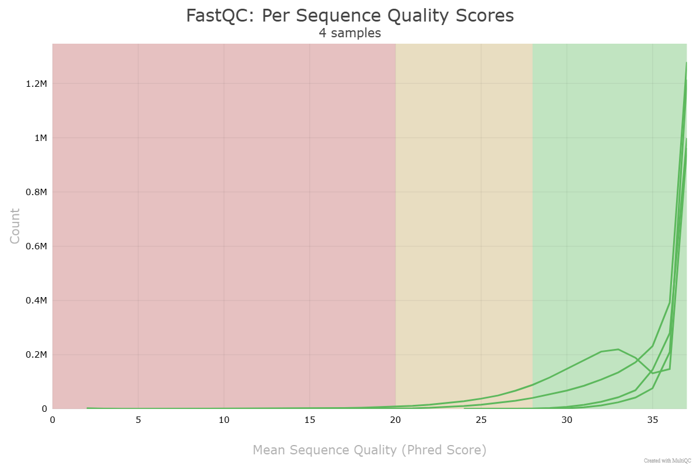
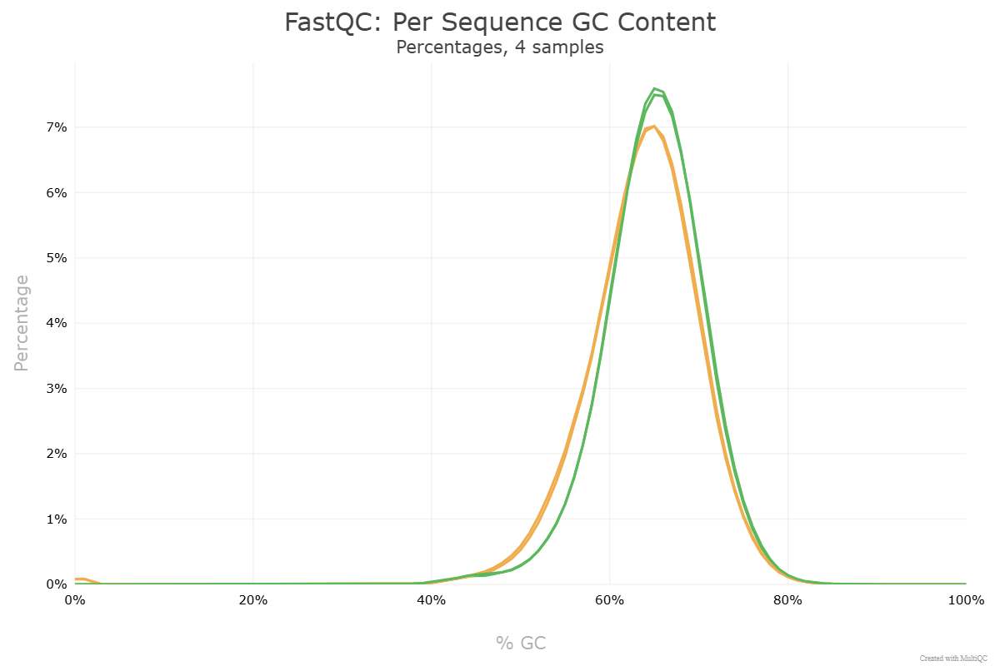
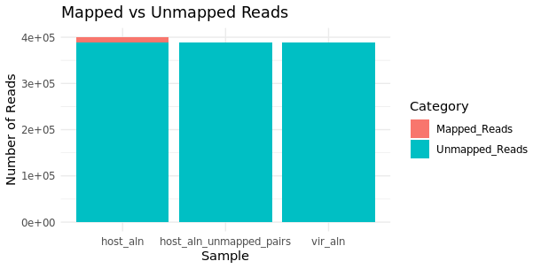
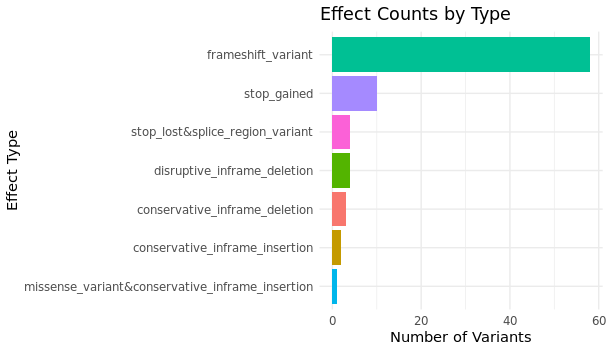

# A Reproducible Low-Resource Workflow for NGS (Next-Generation Sequencing) Variant Detection in *Mycobacterium tuberculosis*

---

## Introduction
Next-generation sequencing (NGS) allows for detailed microbial genome analysis, but many published workflows in clinical genomics rely on specialized pipelines and tools often computationally heavy. This project implements a reproducible, low-resource workflow for *Mycobacterium tuberculosis*, designed as a methodological training framework for students in bioinformatics research.

---

## Background
NGS technologies generate massive amounts of sequence data, requiring careful processing to ensure reliable variant identification. Standard clinical genomic pipelines (e.g., GATK, SURPI) can be computationally intensive and impractical in low-resource settings. Replicating published workflows with accessible tools allows training in key NGS concepts while maintaining reproducibility and methodological rigor.

---

## Objective
To develop a fully reproducible NGS pipeline for quality control, taxonomic profiling, and variant annotation of *M. tuberculosis* sequencing datasets, optimized for low-resource environments.

---

## Methods

### Phase 1 – Quality Control
**Tools:** seqtk, FastQC, MultiQC, Trimmomatic  

**Process:**
- Adapter trimming and low-quality base removal.  
- Read length filtering and per-base quality assessment.  
- Subsampling to 200,000 paired-end reads for computational efficiency.  

**Results:**
- Median Phred score ≥30.  
- GC content adjusted closer to expected *M. tuberculosis* genome (~64%).  
- Minimal duplication; no major contamination.  

**Scripts for reproducibility:** `scripts/qc_commands.sh`  

**Plots:**

---

### Phase 2 – Alignment, Filtering, and Taxonomic Classification
**Tools:** BWA, Centrifuge  

**Process:**
- Host genome removal (human GRCh38) and viral decontamination using a small 10-virus panel.  
- Bacterial classification with selected 25-genome panel.  

**Results:**
- >99% reads classified as *M. tuberculosis*.  
- Low taxonomic diversity likely due to sub-sampling and limited reference panel.  
- Reproducible dataset ready for downstream variant calling.  

**Scripts:** `aligment_taxclass_phase2/`  

**Plots:**

---

### Phase 3 – Variant Calling and Annotation
**Tools:** BWA, FreeBayes, SnpEff  

**Process:**
- Alignment to *M. tuberculosis* reference genome.  
- Variant filtering using allele depth (AD) and allele frequency (AF) thresholds.  
- Functional annotation with SnpEff (HIGH, MODERATE, LOW impact; frameshift, stop-gained, missense).  

**Results:**
- 72 HIGH-impact and 634 MODERATE-impact variants identified.  
- Summary tables generated for effect types (`effect_counts.tsv`, `high_effect_counts.tsv`) and gene-level counts (`top_gene_counts.tsv`, `high_gene_counts.tsv`).  
- HTML summary of variants: `snpEff_summary.html`.  

**Scripts:** `scripts/`  

**Plots / Visualizations:**

[Open SnpEff HTML Summary](plots/snpEff_summary.html)

---

## Results Summary

| Category | Subcategory | Count | Notes / File |
|----------|------------|-------|-------------|
| **Quality Control (Phase 1)** | Reads retained post-trimming | High-quality, median Phred ≥30 | `scripts/qc_commands.sh` |
| | GC content | ~64% | Consistent with *M. tuberculosis* genome |
| | Adapter removal | Successful | Prevented false alignments |
| **Taxonomic Profiling (Phase 2)** | *M. tuberculosis* reads | >99% of bacterial reads | `centrifuge_bac_class_report.tsv` |
| | Viral reads | 0 (against 10-virus DB) | `vir_aln.bam` |
| | Bacterial diversity | Limited (25 bacteria) | Subsampling & reference panel limitations |
| **Variant Annotation (Phase 3)** | HIGH-impact variants | 72 | Frameshift, stop-gained, others |
| | MODERATE-impact variants | 634 | Missense, inframe deletions/insertions |
| | Most frequently affected genes | lppB (7), PPE9 (6), PPE55 (6) | `top_gene_counts.tsv` |
| | Variant effect counts | Missense: 624, Frameshift: 58, Stop-gained: 10 | `effect_counts.tsv`, `high_effect_counts.tsv` |
| | Full variant summary | See SnpEff HTML and TSV files | `snpEff_summary.html`, `report_highModerate.tsv` |

---

## Discussion
This workflow demonstrates practical competence in NGS data processing, variant annotation, and reproducible pipeline development under low-resource conditions. The integration of Bash scripts and R-based visualizations provides students with a hands-on training platform, allowing:
- Exploration of variant filtering metrics.  
- Understanding of subsampling strategies to manage computational load.  
- Engagement with low-resource microbial genomics projects.

High-impact variants in genes such as PE/PPE families and lipid metabolism pathways indicate loci potentially relevant for virulence, immune evasion, and drug resistance.  

---

## Significance
This project demonstrates a complete, reproducible NGS workflow for *M. tuberculosis*, adapted for low computational resources. It cultivates problem-solving and critical reasoning skills while bridging the gap between theoretical knowledge and applied microbial genomics.

---

## Limitations
- Subsampling reduces coverage and sensitivity to low-frequency variants.  
- Small viral and bacterial reference panels limit detection of other microbes.  
- Pipeline intended for methodological training, not for novel biological discovery.

